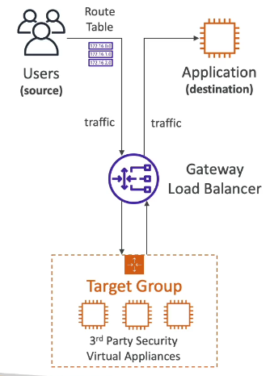
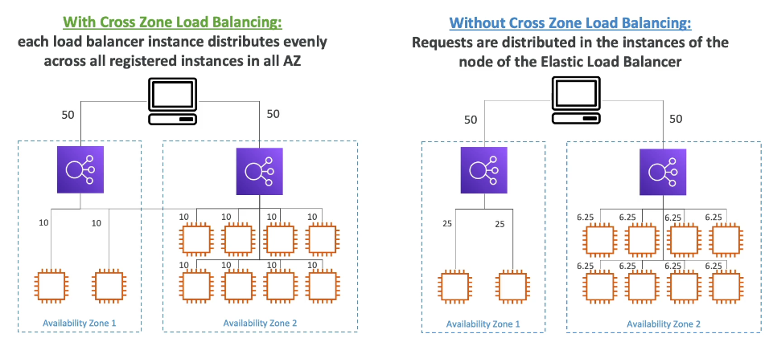

# High Availability & Scalability: ELB & ASG

Prompt to use:

Please summarize the following transcript into a very compact AWS Solutions Architect Associate (SAA) revision cheat sheet.
Include a second-level Markdown title (##) at the top using the section’s main topic.
Format the rest in raw Markdown inside a code block, with no separators.
Use short bullet points, minimal wording, and highlight only SAA-relevant concepts, AWS services, rules, exam tips, and best practices.
Use simple icons when relevant, but keep them limited.
Keep the cheat sheet extremely concise and easy to memorize.
Here’s the transcript:

## Scalability & High Availability

### 🔼 Vertical Scaling (Scale Up/Down)
- Increase instance size (e.g., t2.micro → t2.large)
- Used for non-distributed systems (DBs: RDS, ElastiCache)
- Limited by hardware ceilings
- Simple but not fault-tolerant

### ➕ Horizontal Scaling (Scale Out/In)
- Add/remove instances → distributed systems
- Common for web/modern apps
- Requires stateless design for best results
- Uses Auto Scaling Groups (ASG) + Elastic Load Balancing (ELB)

### 🟢 High Availability (HA)
- Run across ≥2 AZs to survive AZ failure
- HA ≠ scalability (often paired but independent)
- Active-active: multiple AZs serving traffic
- Passive: e.g., RDS Multi-AZ standby

### 🛠 EC2 Scaling Terms
- **Scale Up/Down**: vertical (instance size)
- **Scale Out/In**: horizontal (instance count)
- ASG must span Multi-AZ for HA
- ELB distributes traffic across Multi-AZ targets

### 📝 Exam Tips
- Vertical = bigger box; Horizontal = more boxes
- HA always implies Multi-AZ
- Horizontal scaling requires distributed/stateless design
- ASG + ELB = scalability + HA
- RDS Multi-AZ = HA but **not** read scaling (use Read Replicas)

---
## Elastic Load Balancing overview
### 🎯 Purpose
- Distribute traffic across multiple EC2/backends
- Single public endpoint; users unaware of backend targets
- Enables HA, fault tolerance, scalability

### 🔍 Why Use ELB
- Spread load across instances
- Health checks → route only to healthy targets
- SSL/TLS termination
- Session stickiness (cookies)
- Multi-AZ support
- Public vs internal LB
- Deep AWS integration: ASG, ECS, ACM, CW, R53, WAF, GA

### ❤️ Health Checks
- Protocol + Port + Path (e.g., HTTP:4567/health)
- Must return 200 OK → else instance marked unhealthy
- LB stops routing to unhealthy targets

### ⚙️ Managed ELB Types
- **CLB (old, deprecated)**: HTTP/HTTPS, TCP/SSL  
- **ALB (L7)**: HTTP/HTTPS, WebSocket  
- **NLB (L4)**: TCP/TLS/UDP, ultra-fast, static IP  
- **GWLB (L3)**: IP-level, appliance insertion (firewalls, etc.)
- Prefer newer generation (ALB/NLB/GWLB)

### 🔐 Security Groups
- **LB SG**: allow 0.0.0.0/0 on 80/443
- **EC2 SG**: allow only LB SG as source on app port (e.g., 80)
- Ensures traffic flows *only* through LB

### 📝 Exam Tips
- ALB = L7, path/host-based routing  
- NLB = L4, extreme performance, static IP  
- Health checks critical for ASG + ELB  
- Internal LBs for private traffic; external for internet-facing

---
## Application Load Balancer (ALB)

### 🌐 Overview
- L7 (HTTP/HTTPS only), supports HTTP/2 + WebSockets
- Routes traffic to **Target Groups**
- One ALB → many apps/microservices
- Ideal for microservices, containers (ECS), Lambda

### 🎯 Routing Features
- **Path-based** (/users → TG1, /search → TG2)
- **Host-based** (a.example.com → TG1, b.example.com → TG2)
- **Query/Headers** (e.g., ?Platform=Mobile)
- **Redirects** (HTTP→HTTPS)
- **Fixed responses** (custom 4xx/5xx)

### 🎯 Target Groups
- Types:
  - EC2 instances (w/ ASG)
  - ECS tasks (dynamic port mapping)
  - Lambda functions (serverless)
  - Private IPs (on-prem)
- Health checks defined **per TG**
- ALB picks only healthy targets

### 🧱 Architecture Benefits
- One ALB replaces multiple CLBs
- Perfect for multiple apps on one host (containers)
- Smart routing → microservice patterns

### 🔐 Security
- LB SG: allow 0.0.0.0/0 on 80/443
- EC2 SG: allow only LB SG as source
- Enforces traffic **through** ALB only

### 🧾 X-Forwarded Headers
- `X-Forwarded-For`: Client IP
- `X-Forwarded-Port`: Port
- `X-Forwarded-Proto`: HTTP/HTTPS
- Needed because ALB terminates connections

### 🗂 Listener Rules
- Conditions: Host, Path, Method, Source IP, Headers, Query
- Actions: Forward → TGs, Redirect, Fixed response
- Priorities determine rule evaluation order
- Default rule catches unmatched requests

### 📝 Exam Tips
- ALB = L7, intelligent routing (path/host/query)
- Supports ECS dynamic ports → **critical SAA concept**
- ALB can front Lambda → serverless HTTP ingress
- Health checks always at TG level
- ALB DNS name fixed; no static IP (use NLB if needed)

---
## Network Load Balancer (NLB)

- ⭐ **Layer 4 LB** → TCP / UDP (not HTTP). Low-level, ultra-fast, millions RPS, ultra-low latency.
- ⭐ **Exam trigger**: UDP ✔️ | Extreme performance ✔️ | Static IPs ✔️ → Think **NLB**.

### 🧩 Architecture & Features
- One **static IP per AZ** (can assign **Elastic IPs**).
- Use when app must expose **fixed IPs**.
- Supports **TCP, UDP, TLS, TCP_UDP** listeners.
- Target groups:
  - EC2 instances
  - **IP addresses** (must be private, hard-coded; supports on-prem IPs → hybrid)
  - Another **ALB** (NLB → ALB for static IPs + L7 rules)
- NLB health checks: **TCP / HTTP / HTTPS**.

### ⚙️ SG & Connectivity
- NLB now supports **security groups** (newer feature).
- Backend EC2 SG must **allow inbound** from NLB SG (common exam trap).
- If health checks fail → usually missing SG rule from NLB to targets.

### 🧪 Setup Essentials (SAA exam focus)
- Internet-facing or internal.
- One IP per enabled AZ (AWS-assigned or Elastic IP you choose).
- Listener example: TCP:80 → TG on TCP:80.
- For HTTP app behind NLB: use **HTTP** health checks for accuracy.

### 🏁 Tips
- Hybrid architectures → register private on-prem IPs.
- Need static whitelisted IPs → NLB.
- Need L7 routing + static IP → **NLB in front of ALB**.
- Always check SGs: allow NLB → EC2 for data + health check ports.

---
## Gateway Load Balancer (GWLB)

- ⭐ **Use case**: Insert **firewalls / IDS / IPS / DPI** appliances into all VPC traffic.
- ⭐ Exam trigger: **GENEVE protocol (6081)** → GWLB.

### 🧩 Core Concepts
- **Layer 3 (network layer)** LB → handles **IP packets**.
- Combines:
  - **Transparent gateway** (single entry/exit for all traffic)
  - **Load balancer** (distributes traffic across appliance fleet)

### 🔄 Traffic Flow
1. User traffic → **GWLB**
2. GWLB → **virtual appliances** (EC2 or private IPs)
3. Appliances inspect traffic (allow/drop)
4. Approved traffic → back through GWLB → application  
   → **Transparent to the app**

### 🗂️ Target Groups
- EC2 instances (instance ID)
- Private IPs (incl. on-prem appliances)

### 📌 Key Benefits
- Centralize & scale network security appliances
- Simplifies routing: GWLB updates VPC route tables
- Drop or modify packets before reaching workloads

### 🏁 Tips
- Need traffic inspection at L3 → **GWLB**
- Hybrid security appliances? Use **IP target registration**
- No deep config questions on exam—know **diagram & use case**

---
## ELB Sticky Sessions (Session Affinity)
- 🔁 **Sticky Sessions** = Same client → same backend instance  
- Supported by **CLB**, **ALB**, **NLB**

- ⭐ **Why**  
  - Keep user session on same instance (e.g., login state)  
  - Risk: ⚠️ uneven load if “sticky” users

- 🍪 **How**  
  - Via **cookies** (sent back to LB, then to instance) **except for NLB**

- 🍪 Types of Cookies
  - **Application-based cookie**
    - Generated by **application / target**
    - Custom attributes allowed  
    - Must specify cookie name per target group  
    - ❌ Do NOT use reserved names: `AWSALB`, `AWSALBAPP`, `AWSALBTG`
    - ALB app cookie created by LB: `AWSALBAPP`

  - **Duration-based cookie**
    - Generated by **load balancer**
    - Names:  
      - ALB → `AWSALB`  
      - CLB → `AWSELB`  
    - Expiry = fixed duration (1s–7d)

- ⚙️ **Configuration**
  - Set at **Target Group → Attributes → Stickiness**
  - Modes:  
    - **LB-generated cookie** (set duration)  
    - **Application cookie** (provide name)

- ⛔ When cookie expires → client rebalanced to another instance

---
## Cross-Zone Load Balancing (XZLB)

- 🎯 **Goal**: Distribute traffic evenly across all registered targets in all AZs

- 🔄 **With XZLB ON**
  - Each LB node sends traffic evenly to **all** targets (all AZs)
  - Fixes uneven AZ target counts (e.g., 2 vs 8 instances)
  - ALB: **no inter-AZ data charges**
  - NLB/GWLB: **charges apply** for inter-AZ traffic

- 🚫 **With XZLB OFF**
  - Each LB node sends traffic **only to targets in its AZ**
  - Client traffic split by LB nodes → can cause imbalance if AZs differ in target count

- ⚙️ **Defaults & Charges**
  - **ALB**: XZLB **ON by default**  
    - Can override per **Target Group** (force ON/OFF)  
    - No inter-AZ data charge
  - **NLB / GWLB**: XZLB **OFF by default**  
    - Enabling = 💰 inter-AZ data charges
  - **CLB**: XZLB OFF by default; enabling = **no charge** (legacy)

- 📝 **Exam Tips**
  - ALB = XZLB always available + free  
  - NLB/GWLB = enabling may incur cost  
  - XZLB ensures even distribution across uneven AZ capacity
