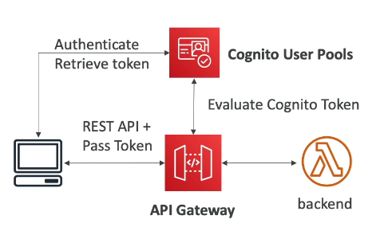
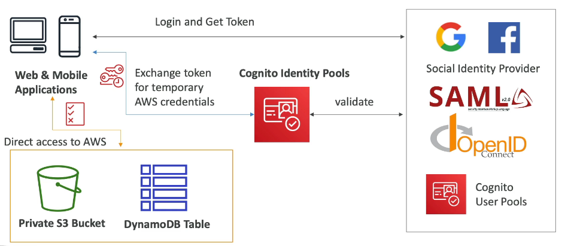

# Serverless: Lambda, API Gateway, Cognito, DynamoDB

- [Serverless: Lambda, API Gateway, Cognito, DynamoDB](#serverless-lambda-api-gateway-cognito-dynamodb)
  - [AWS Lambda](#aws-lambda)
  - [AWS Lambda Limits](#aws-lambda-limits)
  - [AWS Lambda Concurrency \& Throttling](#aws-lambda-concurrency--throttling)
  - [AWS Lambda SnapStart](#aws-lambda-snapstart)
  - [Lambda@Edge \& CloudFront Functions](#lambdaedge--cloudfront-functions)
  - [Lambda Networking Fundamentals](#lambda-networking-fundamentals)
  - [Lambda Integration with RDS \& Aurora](#lambda-integration-with-rds--aurora)
  - [AWS DynamoDB](#aws-dynamodb)
  - [AWS DynamoDB – Advanced Features](#aws-dynamodb--advanced-features)
  - [API Gateway Cheat Sheet](#api-gateway-cheat-sheet)
  - [Step Functions Cheat Sheet](#step-functions-cheat-sheet)
  - [Amazon Cognito](#amazon-cognito)

## AWS Lambda

### Lambda Basics
- **Serverless compute service**
- Run code **without managing servers**
- Executes code **on demand** when triggered
- Max execution time: **15 minutes**
- Automatically scales with concurrency

### EC2 vs Lambda
- **EC2**: servers always running, manual scaling, fixed CPU/RAM
- **Lambda**: no servers, runs only when invoked, auto-scaling, pay-per-use

### Key Benefits
- **Pay per invocation + execution time**
- Very generous **free tier**:
  - 1M requests/month
  - 400,000 GB-seconds compute
- Built-in **high availability & scaling**
- Native **CloudWatch monitoring**
- Tight integration with AWS services

### Performance & Resources
- Memory: up to **10 GB RAM**
- Increasing RAM also increases **CPU & network performance**
- Millisecond-level billing

### Supported Runtimes
- Native: **Node.js, Python, Java, C# (.NET), Ruby**
- Custom Runtime API: **Go, Rust**, others
- Supports **container images**, but:
  - **Exam tip**: prefer **ECS/Fargate** for containers over Lambda

### Common Integrations (Very Important for Exam)
- **API Gateway** → REST APIs
- **S3** → object-created triggers
- **DynamoDB** → stream triggers
- **Kinesis** → data processing
- **SQS** → message processing
- **SNS** → notifications
- **EventBridge / CloudWatch Events** → automation & cron jobs
- **CloudFront (Lambda@Edge)** → edge logic
- **Cognito** → auth-related triggers

### Common Architectures
- **Serverless thumbnail creation**
  - S3 upload → Lambda → thumbnail → S3 + metadata in DynamoDB
- **Serverless CRON jobs**
  - EventBridge rule → Lambda
  - No EC2, no wasted compute

### Security
- Uses **IAM execution role**
- Permissions define what Lambda can access (S3, DynamoDB, etc.)
- Logs written to **CloudWatch Logs**

### Monitoring & Debugging
- Metrics: invocations, duration, errors
- Logs available in **CloudWatch Logs**
- Easy debugging via log streams

### Exam Tips
- Think: **event-driven, serverless, auto-scaling**
- Best for **short-lived, stateless workloads**
- Cheap and scalable by design
- Default choice for **reacting to AWS events**

---
## AWS Lambda Limits

### Scope
- All limits are **per AWS Region**
- Exam frequently tests whether Lambda **can or cannot** be used based on limits

### Execution Limits
- **Memory**:  
  - 128 MB → **10 GB**
  - In **1 MB increments**
  - More memory = more **vCPU & network performance**
- **Max execution time**:  
  - **900 seconds (15 minutes)**
- **Environment variables**:  
  - Max **4 KB**
- **Ephemeral storage (/tmp)**:  
  - Up to **10 GB**
  - Used for temporary files during execution
- **Concurrency**:
  - Default: **1,000 concurrent executions**
  - Can be increased via AWS support request
  - **Reserved concurrency** recommended to control scaling

### Deployment Limits
- **Deployment package (ZIP)**:
  - **50 MB** compressed
  - **250 MB** uncompressed
- Large files should be:
  - Downloaded at runtime
  - Stored temporarily in **/tmp**

### Key Exam Traps
- Needs **>15 minutes** → ❌ Lambda
- Needs **>10 GB RAM** → ❌ Lambda
- Needs **very large local files** (>10 GB) → ❌ Lambda
- Needs **long-running or stateful processing** → ❌ Lambda

### Exam Tip
- When requirements exceed Lambda limits, think:
  - **EC2**
  - **ECS / Fargate**
  - **Batch**
  - **Step Functions (with multiple Lambdas)**
Know these limits and you’ll instantly eliminate wrong answers on the exam.

---
## AWS Lambda Concurrency & Throttling

### Concurrency Basics
- **Concurrency** = number of Lambda executions running at the same time
- Lambda scales automatically with incoming events
- Default **account-level concurrency limit**: **1,000 per region**
- Shared across **all Lambda functions** in the account

### Reserved Concurrency
- Set **per function**
- Guarantees a max number of concurrent executions
- Example: reserve **50**
  - Function can never exceed 50 concurrent runs
- Excess invocations are **throttled**
- Best practice: always set reserved concurrency for critical functions

### Throttling Behavior
- **Synchronous invocation** (API Gateway, ALB, SDK):
  - Throttled → **HTTP 429 error**
- **Asynchronous invocation** (S3, EventBridge, SNS):
  - Throttled events are **queued and retried**
  - Retries for up to **6 hours**
  - Exponential backoff (1 second → 5 minutes)
  - Can end in **DLQ** if configured

### Why Reserved Concurrency Is Important (Exam Favorite)
- Concurrency limit is **shared across all functions**
- One high-traffic Lambda can:
  - Consume all concurrency
  - Cause **other Lambda functions to be throttled**
- Reserved concurrency isolates workloads and prevents outages

### Increasing Concurrency
- If you need **>1,000 concurrent executions**:
  - Open an AWS support ticket
- Plan concurrency early for production workloads

### Cold Starts
- Occur when:
  - A new Lambda instance is created
  - Code & dependencies are initialized
- First request has **higher latency**
- More noticeable with:
  - Large packages
  - Heavy initialization logic
  - VPC-enabled Lambdas (much improved since 2019)

### Provisioned Concurrency
- Keeps Lambda instances **pre-warmed**
- Eliminates cold starts
- Configured on:
  - **Version or Alias** (not `$LATEST`)
- Costs extra (not free)
- Can be managed using **Application Auto Scaling**

### Reserved vs Provisioned Concurrency (Know the Difference)
- **Reserved concurrency**:
  - Limits & protects capacity
  - Prevents noisy neighbors
- **Provisioned concurrency**:
  - Improves latency
  - Pre-initializes execution environments

### Exam Tips
- 429 errors → think **concurrency throttling**
- S3 retries → think **async invocation behavior**
- One Lambda starving others → **missing reserved concurrency**
- Low-latency APIs → **provisioned concurrency**

If the exam mentions throttling, cold starts, or shared limits — this topic is the answer.

---
## AWS Lambda SnapStart

- **Purpose:** Reduce cold start latency (up to **10x**)  
- **Cost:** None  
- **Supported runtimes:** Java, Python, .NET  

### How It Works
1. Lambda function **pre-initialized** at version publish  
2. AWS takes **snapshot** of memory + disk state  
3. Invocation **skips initialization**, starts directly  

### Key Points
- Optimizes **cold starts**, especially for Java/.NET  
- Snapshot is **version-based**  
- Works automatically, no extra management  

**Exam tip:** Cold start + Java/.NET → think **SnapStart**

---
## Lambda@Edge & CloudFront Functions

### Purpose
- **Run code at CloudFront Edge locations** to reduce latency
- **Serverless**, globally deployed, pay-per-use

### Use Cases
- CDN content customization  
- Security & privacy  
- Dynamic web apps, SEO, A/B testing  
- Bot mitigation, image transformation  
- Authentication/authorization, analytics

### CloudFront Functions
- **Runtime:** JavaScript only  
- **Scale:** Millions of requests/sec  
- **Trigger:** Viewer request/response only  
- **Execution time:** <1 ms  
- **Use cases:** Header manipulation, URL rewrites, cache key normalization, JWT auth  

### Lambda@Edge
- **Runtime:** Node.js, Python  
- **Scale:** Thousands of requests/sec  
- **Trigger:** Viewer request/response & origin request/response  
- **Execution time:** 5–10 sec  
- **Capabilities:** External network access, file system access, third-party libraries, heavy logic  

**Exam tip:**  
- **Lightweight, ultra-fast:** CloudFront Functions  
- **Full logic/customization:** Lambda@Edge

---
## Lambda Networking Fundamentals

### Default Lambda Networking
- **Runs outside your VPC** in AWS-managed VPC  
- **Access:** Public APIs, DynamoDB  
- **No access** to private resources (RDS, ElastiCache, internal ALBs)

### Lambda in Your VPC
- Specify **VPC ID, subnets, security group**  
- Lambda gets **ENI (Elastic Network Interface)** in subnets  
- Enables private access to RDS, ElastiCache, internal services  

### Using RDS Proxy
- **Problem:** Direct Lambda→RDS connections can overwhelm DB under high concurrency  
- **Solution:** Lambda connects to **RDS Proxy**, which manages DB connections efficiently  
- **Benefits:**  
  1. Improved scalability via connection pooling  
  2. Reduced failover time by ~66% (RDS & Aurora)  
  3. IAM authentication support via Secrets Manager  

**Exam tip:**  
- **Private DB access:** Lambda must run inside VPC  
- **High-concurrency DB access:** Use RDS Proxy

---
## Lambda Integration with RDS & Aurora

### Direct Lambda Invocation from Database
- Supported by **RDS for PostgreSQL** and **Aurora MySQL**  
- **Use case:** React to data changes, e.g., insert triggers a Lambda to send a welcome email  
- **Setup:** Configured **inside the database**, not AWS Console  

### Requirements
- **Network connectivity:** Lambda must be reachable  
  - Public Lambda, VPC endpoint, or NAT gateway  
- **Permissions:** RDS instance must have IAM permissions to invoke Lambda  

### Important Distinction
- **RDS Event Notifications ≠ Data Events**  
  - Event notifications track **DB instance changes** (creation, snapshots, parameter changes)  
  - Do **not** provide info about table-level data changes  
- **Event Delivery:** Near real-time (~5 min)  
- Can forward to **SNS, SQS, Lambda, EventBridge**  

**Exam tip:**  
- Use **database triggers** for data-level events  
- Use **RDS Event Notifications** only for instance-level events

---
## AWS DynamoDB

### Overview
- Fully managed, Cloud-native NoSQL ✅
- Multi-AZ HA, auto-scaling, low maintenance
- Single-digit ms latency, massive scale (millions req/sec)
- IAM integrated for security & auth
- Use when schema evolves rapidly
- Serverless DB: no database creation, just tables

### Tables & Data
- Tables only, no DB creation needed
- Items = rows, Attributes = columns (flexible, nullable)
- Max item size: 400 KB
- Types: Scalar (String, Number, Binary, Boolean, Null), List, Map, Set
- Table classes: Standard (frequent) & IA (infrequent)
- Each item can have different attributes (flexible schema)
- Encryption at rest supported

### Keys
- Primary key: Partition key ± optional Sort key
- Attributes can be added anytime, schema flexible

### Capacity Modes
- **Provisioned**
  - Set RCU/WCU in advance
  - Auto-scaling optional (min/max units, target utilization)
  - Cost-efficient for predictable load
- **On-Demand**
  - Auto scales reads/writes
  - Pay-per-use
  - Best for unpredictable/spiky workloads
  - 2-3x more expensive than provisioned

### Operations
- Create table → choose partition key ± sort key → configure capacity
- Insert items with custom attributes per item
- View items in table console

### Exam Tips
- Keywords: RCU/WCU, Partition Key, Sort Key, Auto-scaling, On-Demand, Provisioned
- On-Demand → unpredictable workload / spike handling
- Provisioned → predictable workload, cost optimization
- DynamoDB strength: flexible schema, serverless, massive scale, low latency

---
## AWS DynamoDB – Advanced Features

### DAX
- In-memory cache for DynamoDB 🚀
- Microsecond read latency
- No app code changes (API-compatible)
- Best for hot reads, not aggregations
- vs ElastiCache: DAX = item/query cache

### Streams
- Capture INSERT / MODIFY / REMOVE
- **DynamoDB Streams**: 24h retention, Lambda triggers
- **Kinesis Data Streams**: 1y retention, many consumers
- Use: real-time processing, analytics, replication

### Global Tables
- Multi-Region, Active-Active 🌍
- Read/write in any region
- **Requires DynamoDB Streams**

### TTL
- Auto-delete items via epoch timestamp ⏱️
- Common: web sessions, temp/regulatory data

### Backup & DR
- PITR: last 35 days, restore → new table
- On-Demand backups: manual, long-term
- AWS Backup: lifecycle + cross-region copy

### S3 Integration
- Export → S3 (PITR required, no RCUs)
- Import ← S3 (no WCUs, new table)
- Use: Athena, ETL, audit

### Exam Keywords
- DAX = µs cache
- Streams → Lambda
- Global Tables = active-active
- TTL = auto-expiry
- Export/Import = no capacity impact

---
## API Gateway Cheat Sheet

### What it is
- Fully serverless API front door 🚪
- Exposes public REST APIs
- Commonly proxies requests to Lambda
- Adds auth, throttling, caching, stages

### Core Integrations
- **Lambda** (most common, serverless backend)
- **HTTP** (on-prem, ALB, external APIs)
- **AWS Services** (SQS, Step Functions, Kinesis, etc.)
- Use to add auth & rate limiting to backends

### Key Features
- REST & WebSocket APIs
- API versioning (v1, v2…)
- Stages: dev / test / prod
- Request/response validation & mapping
- SDK generation, OpenAPI/Swagger import/export

### Endpoint Types
- **Edge-Optimized (default)** 🌍
  - Global clients, CloudFront managed
- **Regional**
  - Clients in same region
  - Optional custom CloudFront
- **Private**
  - VPC-only via Interface Endpoint
  - Controlled by resource policy

### Security & Auth
- **IAM** → internal AWS apps
- **Cognito** → mobile/web users
- **Lambda Authorizer** → custom logic
- HTTPS via ACM
  - Edge-Optimized cert → us-east-1
  - Regional cert → same region
- Route 53 → Alias / CNAME to API Gateway

### Lambda Proxy Integration
- API Gateway forwards full request to Lambda
- Lambda returns:
  - statusCode
  - headers
  - body
- API Gateway timeout: **29 seconds max** ⏱️

### Deployment
- Must **Deploy API** to a stage
- Invoke URL includes stage name
- Undeployed changes are not live

### Exam Keywords
- API Gateway = serverless API front end
- Lambda Proxy Integration
- Edge vs Regional vs Private
- Cognito vs IAM auth
- 29s timeout limit
- Stages required to expose API

---
## Step Functions Cheat Sheet

### What it is
- Serverless workflow orchestration 🔁
- Visual state machine (graph-based)
- Commonly orchestrates Lambda functions

### Core Capabilities
- Sequencing & parallel execution
- Choice (conditions)
- Retries, timeouts, error handling
- Success/failure paths
- Human approval steps 🧑‍⚖️

### Integrations
- Lambda (most common)
- EC2, ECS tasks
- API Gateway
- SQS
- On-prem & many AWS services

### Use Cases
- Order processing / fulfillment
- Data processing pipelines
- Complex serverless workflows
- Multi-step web applications

### Exam Keywords
- Orchestration (not choreography)
- Visual workflow / state machine
- Error handling & retries built-in
- Serverless coordination of services

---
## Amazon Cognito

### What it is
- Identity service for **web & mobile users** 👤
- Users live **outside AWS** (not IAM users)
- Authentication + authorization layer

### Cognito User Pools (CUP)
- User sign-up & sign-in service
- Username/email + password
- MFA, password reset, email/SMS verification
- Social login (Google, Facebook, etc.)
- Issues JWT tokens

### CUP Integrations
- **API Gateway** → token validation → Lambda
- **Application Load Balancer** → auth at ALB level
- Offloads auth from backend

### Cognito Identity Pools (Federated Identities)
- Provides **temporary AWS credentials** 🔐
- Users can access AWS services directly
- Sources:
  - Cognito User Pools
  - Social logins
  - SAML / OIDC
- IAM roles & policies defined per user
- Supports guest & authenticated roles

### Key Use Cases
- Mobile / web app authentication
- Direct access to S3 or DynamoDB
- Fine-grained IAM permissions
- **Row-level security in DynamoDB**
  - IAM condition on partition key = userId

### Exam Keywords
- User Pools = authentication
- Identity Pools = AWS credentials
- Not IAM users
- API Gateway / ALB + Cognito
- Temporary credentials
- Row-level DynamoDB security
