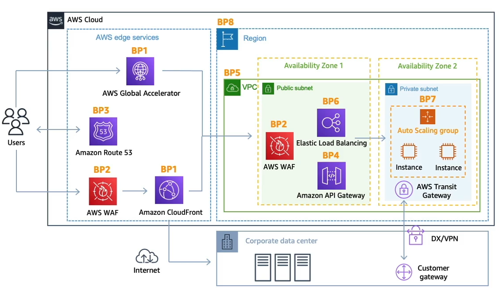

# AWS Security & Encryption: KMS, SSM Parameter Store, Shield, WAF

- [AWS Security \& Encryption: KMS, SSM Parameter Store, Shield, WAF](#aws-security--encryption-kms-ssm-parameter-store-shield-waf)
  - [Encryption Overview](#encryption-overview)
  - [AWS KMS](#aws-kms)
  - [KMS Multi-Region Keys](#kms-multi-region-keys)
  - [S3 Replication \& KMS](#s3-replication--kms)
  - [SSM Parameter Store](#ssm-parameter-store)
  - [Secrets Manager](#secrets-manager)
  - [Certificate Manager - ACM](#certificate-manager---acm)
  - [CloudHSM vs KMS](#cloudhsm-vs-kms)
  - [AWS WAF / Shield / Firewall Manager](#aws-waf--shield--firewall-manager)
  - [AWS DDoS Protection – Solution Architecture](#aws-ddos-protection--solution-architecture)
  - [AWS Threat Detection \& Vulnerability Services (Exam-Compact)](#aws-threat-detection--vulnerability-services-exam-compact)

## Encryption Overview

### 🔒 Encryption in Flight (TLS/SSL)
- Encrypts data **before sending**, decrypts on receive
- Protects against **man-in-the-middle attacks**
- Uses **TLS certificates** → HTTPS
- Ensures only **target server** can read data
- Example: secure login with username/password

### 🗄️ Server-Side Encryption at Rest (SSE)
- Data encrypted **after reaching server**, decrypted before sending
- Uses **data keys** managed by server/service
- Example: **S3 SSE** encrypts objects on storage
- Server **controls keys**, handles encryption/decryption
- Works with HTTPS for additional **in-flight security**

### 🧑‍💻 Client-Side Encryption
- Data encrypted/decrypted **by client**, server **cannot decrypt**
- Client holds **data keys**
- Encrypted object can be stored anywhere (S3, EBS, FTP)
- Decryption requires **client-side key**
- Ideal when server **cannot be trusted**

### ⚡ Exam Tips / Best Practices
- **In-flight** = TLS/SSL (HTTPS)
- **At rest** = SSE (server-managed) or client-side
- **Client-side** = full control of keys
- Know **who manages keys** → key SAA exam distinction

---
## AWS KMS

### 🔑 AWS Key Management Service (KMS)
- Central **encryption key management** for AWS services
- Fully integrated with **IAM** for access control
- **Audit API calls** via **CloudTrail** (exam focus)
- Used by most services: **S3, EBS, RDS, SSM, DynamoDB**
- Can encrypt secrets **via API/CLI/SDK**

### 🔑 KMS Key Types
- **Symmetric**: single key for encrypt/decrypt (most AWS services)
- **Asymmetric**: public/private key pair; encrypt/decrypt or sign/verify
- **AWS owned keys**: free, used internally by services (S3, DynamoDB)
- **AWS managed keys**: free, per service (AWS/S3, AWS/RDS)
- **Customer managed keys**: $1/month, can import, cross-account use, full control
- **Imported keys**: manual management, $1/month

### 🌍 Key Scope & Rotation
- Keys **per region**; snapshots copied across regions require re-encryption
- **Automatic rotation**: 
  - AWS managed: 1 year
  - Customer managed: configurable
- **On-demand rotation** possible
- Use **aliases** for easier reference

### 📝 KMS Key Policies
- Like S3 bucket policies; control **who can use/administer key**
- **Default policy**: IAM users in account can use key
- **Custom policy**: fine-grained, cross-account access
- Required for **sharing encrypted snapshots** or cross-account encryption

### ⚡ Exam Tips / Best Practices
- Symmetric = default for AWS service encryption
- Cross-account snapshot = customer managed key + key policy
- Always encrypt secrets, never store plaintext
- Monitor key usage via CloudTrail
- Understand **key types, scope, rotation, and policy differences**

### 💻 KMS CLI/SDK Basics
- **Encrypt**: specify key ID/alias/ARN + plaintext file → encrypted blob
- **Decrypt**: encrypted blob → plaintext output
- Encrypted files are **binary/base64**
- SDK abstracts low-level CLI steps

---
## KMS Multi-Region Keys

### 🌍 Multi-Region Keys (MRK)
- One **primary key** + **replicas**
- **Same key ID & key material**
- Encrypt in Region A, decrypt in Region B
- Rotation replicated automatically

### 🔑 Key Facts
- **Not global** (regional resources)
- Each replica has its **own key policy**
- No cross-Region KMS calls
- Avoid re-encryption when moving data

### ✅ Use Cases (Exam)
- **Client-side encryption**
- **DynamoDB Global Tables** (attribute-level)
- **Aurora Global DB** (column-level)
- Low-latency local decrypt

### 🛡️ Security Pattern
- Encrypt **specific fields only** (e.g. SSN)
- Use **DynamoDB Encryption Client** / **AWS Encryption SDK**
- Data hidden even from **DB admins**

### ⚡ Exam Tips
- Default KMS = single-Region
- MRK only for **global + client-side encryption**
- Same key ID across Regions = MRK

---
## S3 Replication & KMS

### 🔁 S3 Replication + Encryption
- **Unencrypted + SSE-S3** → replicated by default
- **SSE-C** → replicated
- **SSE-KMS** → ❌ not by default
  - Must **enable KMS replication option**
  - Specify **target KMS key**

### 🔑 SSE-KMS Replication Requirements
- IAM Role allows S3 to:
  - **Decrypt** source object
  - **Re-encrypt** in target bucket
- Update **target KMS key policy**
- High volume → may hit **KMS throttling** (quota increase)

### 🌍 Multi-Region Keys + S3 Replication
- Supported but **no special benefit**
- S3 still **decrypts + re-encrypts**
- MRK treated as **independent keys** by S3

### 🖥️ Encrypted AMI Cross-Account (Exam Favorite)
Steps to launch EC2 in Account B from encrypted AMI in Account A:
1. **Share AMI** → modify **launch permissions**
2. **Share KMS key** → update **key policy**
3. In Account B:
   - IAM role/user with KMS permissions:
     - `DescribeKey`, `Decrypt`, `ReEncrypt`, `CreateGrant`
4. Launch EC2
5. (Optional) **Re-encrypt volumes** with Account B’s KMS key

### ⚡ Exam Tips
- SSE-KMS replication = extra config required
- AMI sharing always needs **AMI + KMS access**
- Watch for **decrypt + re-encrypt** patterns

---
## SSM Parameter Store

### 🗂️ Purpose
- Store **config & secrets**
- Serverless, durable, versioned
- Integrated with **IAM, KMS, CloudFormation**

### 🔐 Types
- **String**
- **StringList**
- **SecureString** → KMS encrypted

### 🧱 Hierarchy
- Path-based: `/app/env/key`
- Simplifies **IAM access control**

### 🔑 Encryption
- SecureString uses **KMS**
- Default: `alias/aws/ssm`
- App needs **KMS decrypt permission**

### 📦 Tiers
- **Standard** (Free): 4 KB
- **Advanced** ($): 8 KB + **policies**

### ⏱️ Policies (Advanced)
- **TTL / expiration**
- **No-change alerts**
- Events via **EventBridge**

### 🔄 Access
- SDK / CLI / Console
- CLI flags:
  - `--with-decryption`
  - `--recursive`

### ⚡ Exam Tips
- Use for secrets (not plaintext in code)
- Hierarchy + IAM = key design
- Advanced tier = TTL + notifications

---
## Secrets Manager

### 🔐 Purpose
- Store & manage **secrets**
- Built-in **automatic rotation**
- Integrated with **RDS, Aurora, Redshift, DocumentDB**
- Uses **KMS** for encryption

### 🔄 Key Features
- **Force rotation** every X days
- **Auto-generate secrets** via Lambda
- Native DB credential management
- SDK / API access

### 🌍 Multi-Region Secrets
- **Replicate secrets across Regions**
- Readers kept in sync with primary
- Promote replica for **DR / failover**
- Ideal for **multi-Region apps & databases**

### 🔑 Security & Access
- Encrypted with **KMS** (AWS-managed or customer key)
- Access controlled by **IAM + resource policy**
- Cross-account access supported

### 💰 Pricing (Exam Aware)
- $0.40 / secret / month
- $0.05 per 10k API calls

### ⚡ Secrets Manager vs Parameter Store
- Secrets Manager = **rotation + DB integration**
- Parameter Store = **cheaper, simpler, optional KMS**
- Exam: **RDS + secrets → Secrets Manager**

### ⚡ Exam Tips
- Rotation ⇒ **Secrets Manager**
- RDS/Aurora credentials ⇒ **Secrets Manager**
- Multi-Region secrets ⇒ DR & global apps

---
## Certificate Manager - ACM

### 🔐 What
- Manage **TLS/SSL certs** → HTTPS
- **Public certs free**, auto-renew
- Encrypts **in-flight data**

### 🔗 Works With
- **ALB / NLB / CLB**
- **CloudFront**
- **API Gateway**
- ❌ Not EC2

### 📝 Public Certs
- Domains: FQDN / wildcard
- Validation:
  - **DNS (preferred)** → auto-renew
  - Email
- Route 53 = automatic
- Renewed **60 days before expiry**

### ⛔ Imported Certs
- **No auto-renew**
- Expiry alerts:
  - **EventBridge**
  - **AWS Config** (`acm-certificate-expiration-check`)

### 🌍 API Gateway + ACM
- **Edge-Optimized** → cert in **us-east-1**
- **Regional** → cert in same region
- **Private API** → no ACM

### ⚡ Exam Tips
- HTTPS = ACM
- CloudFront certs always **us-east-1**
- Imported ≠ auto-renew
- Cannot export ACM public certs

---
## CloudHSM vs KMS

### CloudHSM 🔐

- **Dedicated HSM hardware** (single-tenant)  
- **You manage keys** (AWS no access)  
- **FIPS 140-2 Level 3**  
- **Symmetric, asymmetric, signing, hashing**  
- **No free tier**  
- Requires **CloudHSM client**

### Availability & Access 🏗️

- **Multi-AZ cluster**, key replication  
- Deployed in **VPC**  
- Own **users & permissions** (not IAM)

### Integrations 🔗

- **KMS Custom Key Store**  
  - KMS uses **CloudHSM-backed keys**  
  - Works with **EBS, S3, RDS, Redshift**  
  - **CloudTrail logs** KMS → HSM calls

### Use Cases ✅

- **SSE-C for S3**  
- Strict compliance / full key ownership  
- **SSL/TLS, Oracle TDE acceleration**

### CloudHSM vs KMS 🆚

- **Tenancy**: HSM \= single | KMS \= multi  
- **Key control**: HSM \= customer | KMS \= AWS-managed  
- **Auth**: HSM users | KMS IAM  
- **Cost**: HSM paid | KMS free tier

### Exam Tip 🧠

- Need **hardware \+ exclusive key control** → **CloudHSM**  
- Default AWS encryption → **KMS**

---
## AWS WAF / Shield / Firewall Manager

### 🧱 AWS WAF (Layer 7)
- Protects **HTTP/HTTPS** apps
- Targets:
  - **ALB**, **API Gateway**
  - **CloudFront**
  - **AppSync**, **Cognito**
- ❌ Not NLB (Layer 4)

**Rules**
- IP sets (10k IPs)
- SQLi, XSS
- Headers / URI / body
- Geo match
- Rate-based (DDoS L7)
- Web ACL = rules container  
- Regional (CloudFront = global)

**Tip**
- Fixed IP + WAF → **Global Accelerator + ALB**

### 🛡️ AWS Shield (DDoS)
- **Shield Standard** (Free)
  - L3/L4 attacks (SYN, UDP floods)
- **Shield Advanced** (~$3k/month)
  - Advanced DDoS protection
  - EC2, ELB, CloudFront, GA, Route 53
  - 24/7 DDoS Response Team
  - Auto **WAF rule creation**
  - Cost protection during attacks

### 🧰 Firewall Manager
- **Centralized firewall management**
- Requires **AWS Organizations**
- Manages:
  - WAF rules
  - Shield Advanced
  - Security Groups
  - Network Firewall
  - Route 53 DNS Firewall
- Auto-applies rules to **new resources**

### ⚡ Exam Mindset
- L7 protection → **WAF**
- DDoS → **Shield**
- Multi-account automation → **Firewall Manager**
- WAF + fixed IP → **Global Accelerator**
- NLB ≠ WAF

---
## AWS DDoS Protection – Solution Architecture

### 🌍 Edge-Level Protection (Best)
- CloudFront  
  - Global edge caching  
  - Built-in Shield Standard  
  - + WAF for L7 filtering  
- Global Accelerator  
  - Fixed IPs, global edge  
  - Shield protection  
  - Use when backend ≠ CloudFront compatible  
- Route 53  
  - Global DNS at edge  
  - DNS DDoS protection  

👉 Edge = traffic absorbed before reaching backend

### 🧱 Infrastructure Layer Defense (BP1, BP3, BP6)
- ELB spreads traffic  
- Auto Scaling absorbs spikes  
- CloudFront / Global Accelerator / Route 53  
  - Protect EC2 from direct exposure  
- Goal: handle traffic upstream, not on EC2

### 🧠 Application Layer Defense (BP1, BP2)
- WAF on CloudFront / ALB / API Gateway  
  - IP blocking  
  - SQLi / XSS  
  - Geo-blocking  
  - Rate-based rules  
- CloudFront  
  - Serves static content at edge  
- Shield Advanced  
  - Auto-creates WAF rules for L7 DDoS  

### 🕶️ Reduce Attack Surface (BP1, BP4, BP6)
- Hide backend (EC2 / Lambda / ECS)  
  - Use CloudFront, ALB, API Gateway  
- Lock down with  
  - Security Groups  
  - NACLs  
- API Gateway  
  - Edge-optimized or Regional + CloudFront  
  - Throttling & burst limits  
  - API keys  
  - WAF integration  

### 🧠 Exam Mindset
- Edge first = best DDoS defense  
- L3/L4 → Shield  
- L7 → WAF  
- Fixed IP + WAF → Global Accelerator + ALB  
- Hide backend = reduce attack surface

---
## AWS Threat Detection & Vulnerability Services (Exam-Compact)

### 🕵️ Amazon GuardDuty
- Intelligent **threat detection**
- Uses ML, anomaly detection, 3rd-party intel
- One-click enable, 30-day trial, no agents

**Log Sources (Default)**
- CloudTrail  
  - Management events  
  - Data events (S3)
- VPC Flow Logs
- DNS Logs

**Optional Data Sources**
- S3 data events
- EKS audit logs & runtime
- RDS / Aurora login activity
- EBS volumes
- Lambda network activity

**Outputs**
- Findings → EventBridge
- Automations via Lambda / SNS
- Detects **crypto-mining attacks** (exam favorite)

---

### 🔍 Amazon Inspector
- **Automated vulnerability scanning**

**Targets**
- EC2 (via SSM agent)
- ECR container images
- Lambda functions

**What It Checks**
- CVE package vulnerabilities
- EC2 network reachability
- Continuous / on-deploy scanning
- Re-runs when CVE DB updates

**Outputs**
- Risk scores
- Findings → Security Hub
- Events → EventBridge

---

### 🧠 Amazon Macie
- **Sensitive data discovery** (PII)
- S3-only
- ML + pattern matching
- One-click enable

**Flow**
- Scans S3 buckets
- Identifies PII
- Findings → EventBridge → SNS / Lambda

---

### 🧠 Exam Mindset
- Threat detection → **GuardDuty**
- Vulnerabilities → **Inspector**
- PII in S3 → **Macie**
- Findings → **EventBridge**
